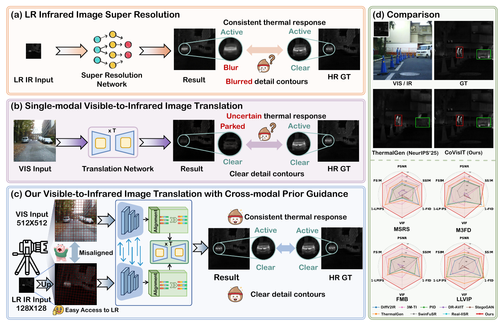
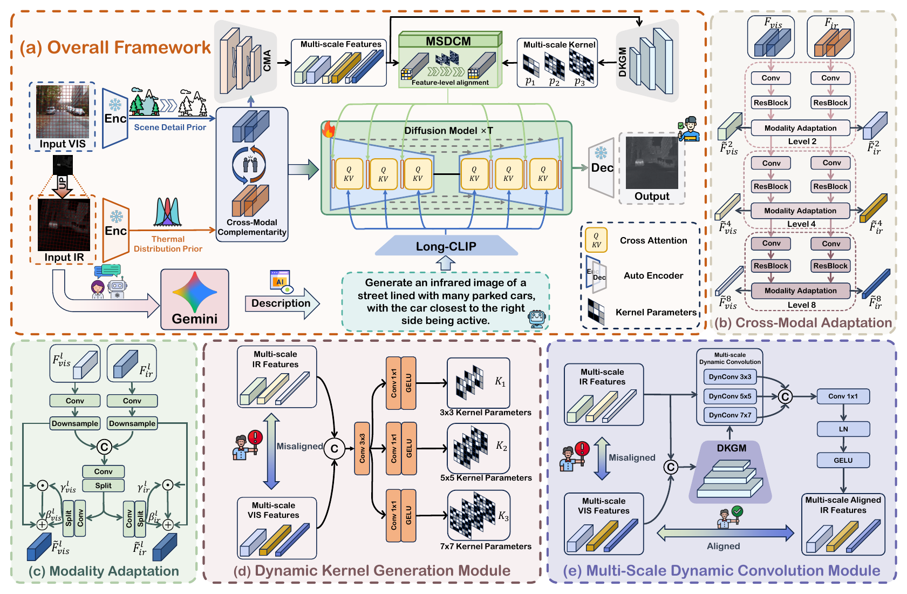
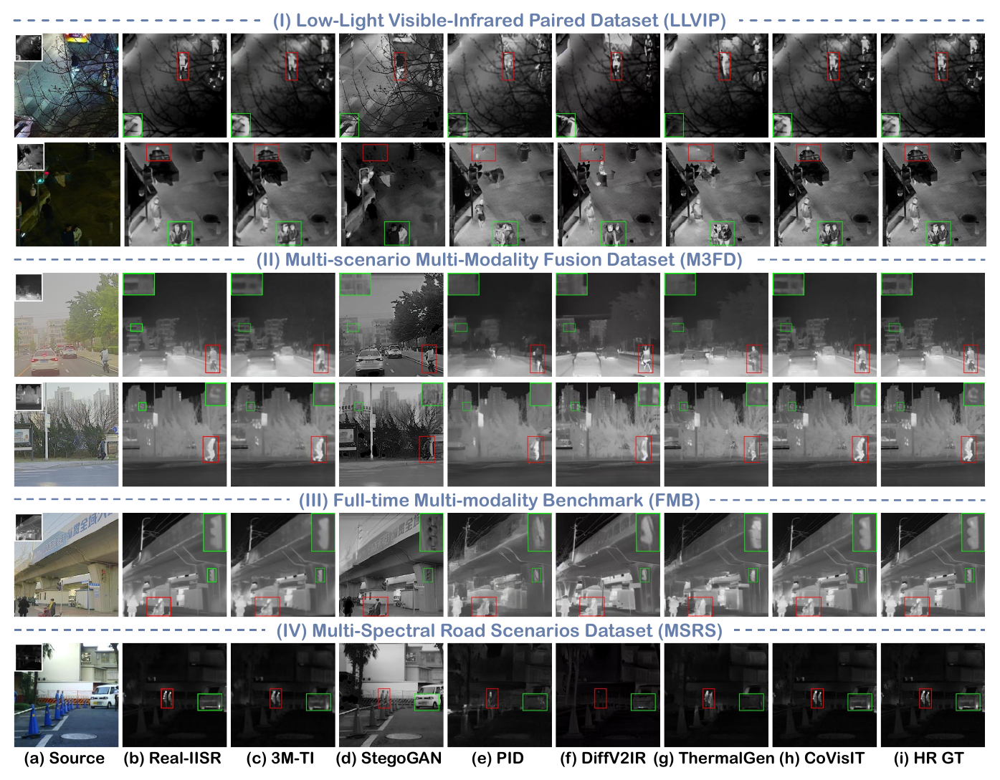
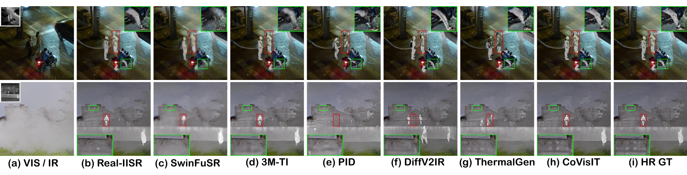
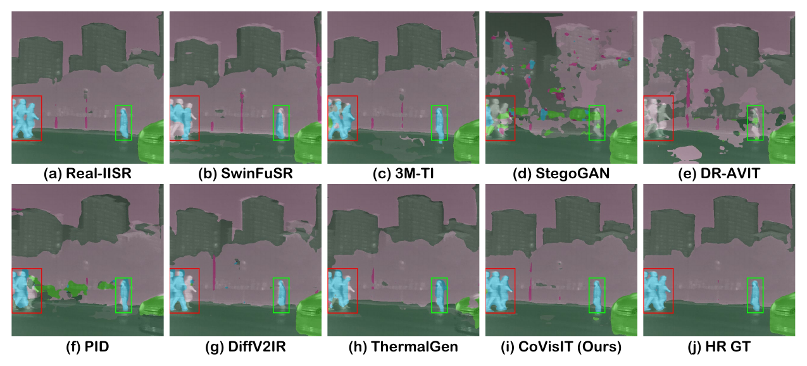
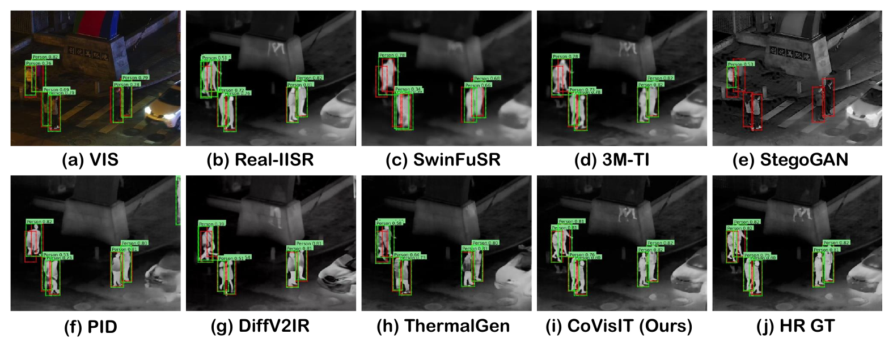

<h1 align="center">CoVisIT: Cross-modal Prior Guided Diffusion Model for Visible-to-Infrared Image Translation</h1>

<p align="center">
  <a href="https://linfeng-tang.github.io/">Linfeng Tang</a>, Hu Tong, Zizhuo Li, Hao Zhang, Han Xu, Zhenfeng Shao, <a href="https://jiayi-ma.github.io/">Jiayi Ma</a>
</p>

<p align="center"><strong>NeurIPS 2026 · Accepted</strong></p>

<p align="center">
  
  
  
</p>

<p align="center"><strong>High-resolution infrared generation with visible detail priors and low-resolution infrared thermal cues.</strong></p>

> This is the official project repository for CoVisIT. It currently contains the project overview and paper figures. Source code, pretrained models, and a public paper link are not yet available; this repository is not yet runnable.

## ✨ News

- **[2026-09-25]** CoVisIT was accepted by **NeurIPS 2026**!

## 🔎 Overview

Visible-to-infrared translation must recover both fine scene structures and reliable thermal responses. Visible images provide detailed structural cues, but do not directly observe thermal radiation. Low-resolution infrared images provide thermal-distribution cues, yet may lack detail and be spatially misaligned with the visible input.

**CoVisIT** combines a high-resolution visible image with a potentially misaligned low-resolution infrared image in a latent diffusion framework. It generates a high-resolution infrared image aligned with the visible input, using visible features for scene details and infrared features for thermal-distribution guidance. Auxiliary scene descriptions extracted from the infrared input provide additional text conditioning.

### Motivation



Unlike visible-only translation, CoVisIT uses observed infrared cues to constrain thermal responses. Unlike infrared super-resolution alone, it also exploits visible scene details and explicitly addresses cross-modal misalignment at the feature level.

## 🧩 Method



The framework contains three main components:

1. **Cross-Modal Adaptation (CMA):** bidirectional feature calibration reduces the visible-infrared representation gap and enables complementary prior extraction.
2. **Dynamic Kernel Generation Module (DKGM):** cross-modal features predict input-adaptive kernels at multiple scales.
3. **Multi-Scale Dynamic Convolution Module (MSDCM):** the generated kernels dynamically aggregate local infrared features for implicit alignment during denoising.

The denoising U-Net is conditioned on visible detail features, aligned infrared thermal features, and text features encoded by Long-CLIP. The training objective combines diffusion, image reconstruction, and thermal-distribution consistency losses.

## 📷 Results

### Infrared Image Generation

The paper evaluates infrared generation on **LLVIP, M3FD, FMB, and MSRS**, using PSNR, SSIM, FSIM, VIF, LPIPS, and FID.



### Downstream Image Fusion

Generated infrared images are fused with their visible counterparts using **EMMA** to evaluate their usefulness for image fusion.



### Semantic Segmentation

The paper trains **SegNeXt** on ground-truth infrared images from **FMB** and evaluates it on generated infrared images.



### Object Detection

The paper trains **YOLOv8** on ground-truth infrared images from **LLVIP** and evaluates it on generated infrared images.



Selected downstream results reported in the paper are shown below. **HR GT** is the real high-resolution infrared reference, not another generation method.

| Task / dataset | Metric | CoVisIT | HR GT reference |
| --- | --- | ---: | ---: |
| Semantic segmentation / FMB | mIoU (%) ↑ | 48.2 | 52.0 |
| Semantic segmentation / FMB | mAcc (%) ↑ | 58.6 | 62.6 |
| Object detection / LLVIP | AP@0.50 ↑ | 0.981 | 0.987 |
| Object detection / LLVIP | mAP@0.5:0.95 ↑ | 0.676 | 0.712 |

**Limitations.** The evaluation uses simulated low-resolution and misaligned infrared inputs; real sensor degradations can be more complex. Diffusion sampling is also slower than feed-forward generation.

## 📦 Release Status

- [x] Project overview and figures
- [ ] Public paper link
- [ ] Source code and environment requirements
- [ ] Pretrained models
- [ ] Training, inference, and evaluation instructions

The release timing has not been announced. Installation commands and model download links will be added when the implementation is released.

## 🎓 Citation

If this work is useful for your research, please consider citing:

```bibtex
@inproceedings{Tang2026CoVisIT,
  title={CoVisIT: Cross-modal Prior Guided Diffusion Model for Visible-to-Infrared Image Translation},
  author={Tang, Linfeng and Tong, Hu and Li, Zizhuo and Zhang, Hao and Xu, Han and Shao, Zhenfeng and Ma, Jiayi},
  booktitle={Advances in Neural Information Processing Systems (NeurIPS)},
  year={2026},
  note={Accepted}
}
```

## 🤝 Contact

For questions and academic discussions, please contact **Linfeng Tang** at [linfeng0419@gmail.com](mailto:linfeng0419@gmail.com).
